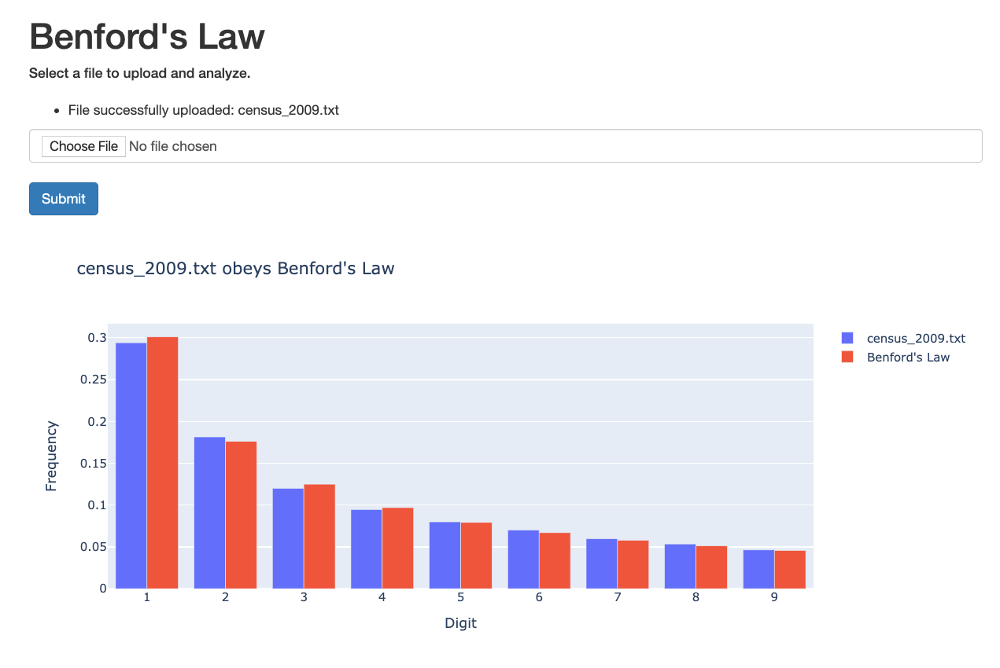

# Benford's Law

Simple website to support uploading a file for visualizing Benford's Law.

In addition to a simple histogram showing the distribution of leading digits from numbers in the file, a distribution of Benford's Law is presented. Using a simple Chi-Squared test, the code determines if there is sufficient evidence to suggest that the file's data is not consistent with Benford's Law. Chi-Squared seems to be the appropriate hypthesis test, although for small samples, the Kolmogorov–Smirnov test might be more appropriate.

The app is fairly permissive in terms of extracting numbers from the file that has been uploaded. The census example file seemed to have a bit of structure, but I didn't want to restrict the app to that fixed format.

Build Instructions:
* docker build -t benford:latest .
* docker run -d -p 5000:5000 benford
* Visit localhost:5000 in a browser

